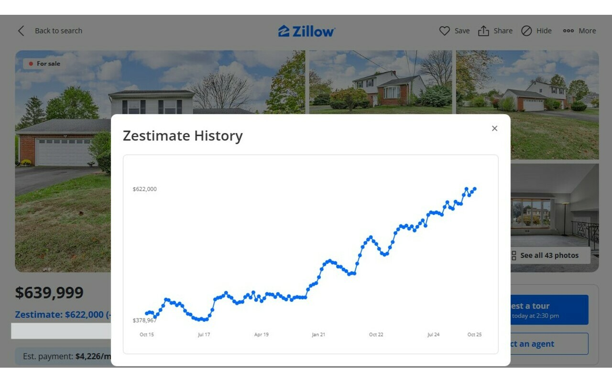

# ShowZest - Chrome Extension

Zillow doesn't show its Zestimate(TM) on many home detail pages, mostly homes with active listings. This Chrome extension pulls that data and makes it available and obvious to the user, giving a better sense of whether the listing price is close to what Zillow estimates the home's value to be.

## Features
- **Current Zestimate Display**: Shows the current Zestimate next to the listing price with price difference calculation
- **Interactive Chart**: Click the "View Chart" button to see Zestimate history over time
- **Hover Tooltips**: Interactive chart points with detailed price and date information
- **Clean Integration**: Native-looking UI that seamlessly integrates with Zillow's design

### Screenshots

**Zestimate Display**


**Interactive Chart Modal**


## Development Setup

### Prerequisites
- Node.js (any recent version)
- Google Chrome browser
- Git

### Getting Started

1. **Clone and install dependencies:**
   ```bash
   git clone https://github.com/RobertBattaglia/showzest.git
   cd showzest
   npm install
   ```

2. **Build the extension:**
   ```bash
   npm run build
   ```
   This creates the `build/` directory with compiled JavaScript files.

3. **Load extension in Chrome:**
   - Open Chrome and go to `chrome://extensions/`
   - Enable "Developer mode" (toggle in top right)
   - Click "Load unpacked"
   - Select the `showzest` project directory (not the build folder)

4. **Test the extension:**
   - Navigate to any Zillow home details page (e.g., `https://www.zillow.com/homedetails/...`)
   - You should see:
     - The Zestimate displayed next to the price
     - A "View Chart" button near the Save/Share buttons
     - Click the chart button to see the interactive price history

### Development Workflow

1. **Make changes** to TypeScript files in `src/`
2. **Rebuild** with `npm run build`
3. **Reload extension** in Chrome:
   - Go to `chrome://extensions/`
   - Click the refresh icon on the ShowZest extension
4. **Refresh** any open Zillow tabs to see changes

### File Structure
```
showzest/
├── src/
│   ├── background.ts    # Extension background script
│   └── script.ts        # Main content script with UI logic
├── icons/               # Extension icons
├── build/               # Compiled output (generated)
├── manifest.json        # Chrome extension manifest
└── package.json         # Dependencies and build scripts
```

### Key Commands
- `npm run build` - Compile TypeScript to JavaScript (minified with source maps)
- `npm run build:dev` - Compile TypeScript to JavaScript (unminified with source maps for debugging)
- `git checkout main` - Switch to main branch
- `git checkout chart-feature` - Switch to chart feature branch

### Debugging
- **For debugging**: Use `npm run build:dev` to create unminified code with source maps
- Open Chrome DevTools on any Zillow page to see console logs and step through TypeScript source
- Check the extension's background script logs at `chrome://extensions/` → ShowZest → "service worker" link
- Source maps allow you to set breakpoints and step through the original TypeScript code
- Use `console.log()` statements in the TypeScript code for debugging
